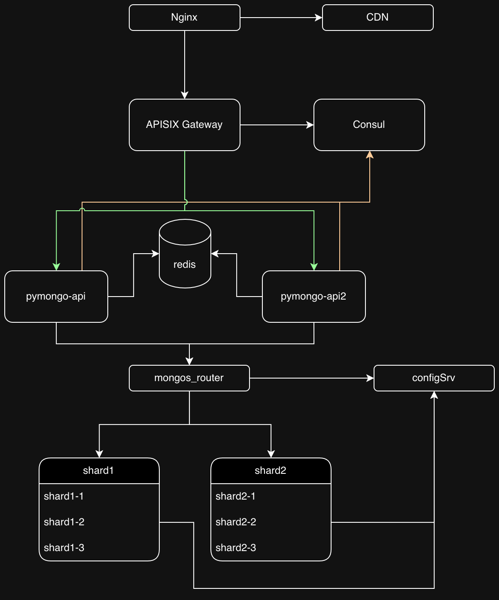

# Проектная работа 4

# Итоговая схема



## Как запустить задание 4

Заходим в папку sharding-repl-cache

```shell
cd sharding-repl-cache
```

Запускаем mongodb и приложение

```shell
docker compose up -d
```

Выполняем все настройки после успешного запуска docker compose

```shell
./scripts/mongo-init.sh
```

## Как проверить

### Если вы запускаете проект на локальной машине

Откройте в браузере http://localhost:8080

### Если вы запускаете проект на предоставленной виртуальной машине

Узнать белый ip виртуальной машины

```shell
curl --silent http://ifconfig.me
```

Откройте в браузере http://<ip виртуальной машины>:8080

## Доступные эндпоинты

Список доступных эндпоинтов, swagger http://<ip виртуальной машины>:8080/docs