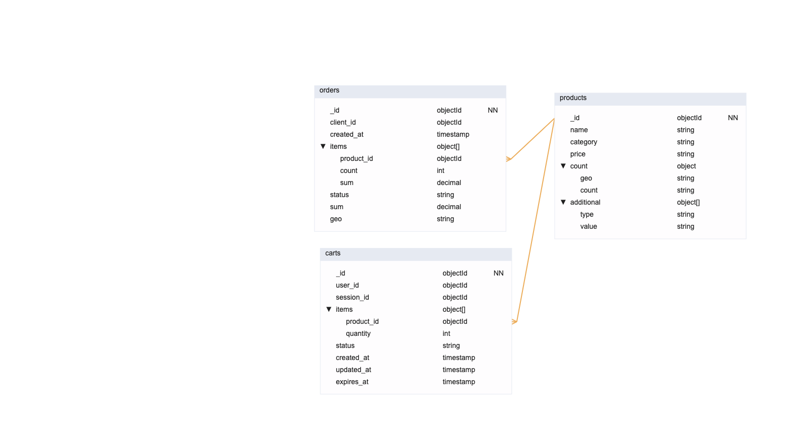

# Задание 7. Проектирование схем коллекций для шардирования данных

## Решение

### Схема данных

db.createCollection("products", {
  validator: {
    $jsonSchema: {
      bsonType: "object",
      title: "products",
      required: ["_id"],
      properties: {
        "_id": { bsonType: "objectId" },
        "name": { bsonType: "string" },
        "category": { bsonType: "string" },
        "price": { bsonType: "decimal" },
        "count": { bsonType: "object", title: "count", properties: { "geo": { bsonType: "string" }, "count": { bsonType: "string" }, }, },
        "additional": { bsonType: "array", items: { bsonType: "object" } },
      },
    },
  },
});

db.createCollection("orders", {
  validator: {
    $jsonSchema: {
      bsonType: "object",
      title: "orders",
      required: ["_id"],
      properties: {
        "_id": { bsonType: "objectId" },
        "client_id": { bsonType: "objectId" },
        "created_at": { bsonType: "timestamp" },
        "items": { bsonType: "array", items: { bsonType: "object" } },
        "status": { bsonType: "string" },
        "sum": { bsonType: "decimal" },
        "geo": { bsonType: "string" },
      },
    },
  },
});

db.createCollection("carts", {
  validator: {
    $jsonSchema: {
      bsonType: "object",
      title: "carts",
      required: ["_id"],
      properties: {
        "_id": { bsonType: "objectId" },
        "user_id": { bsonType: "objectId" },
        "session_id": { bsonType: "objectId" },
        "items": { bsonType: "array", items: { bsonType: "object" } },
        "status": { bsonType: "string" },
        "created_at": { bsonType: "timestamp" },
        "updated_at": { bsonType: "timestamp" },
        "expires_at": { bsonType: "timestamp" },
      },
    },
  },
});

### Шардирование

Схема: products
Ключ:  _id
Метод: По хешу
Причина: Чаще всего обновляем остатки продуктов и такой ключ позволит быстро найти продукт для обновления. Также этот ключ поможет равномерно распределить данные. У нас также есть поиск по категориям и цене, но если мы возьмем category или price, то можем очень неравномерно распределить данные, а при изменении цены их еще и перемещать нужно будет довольно часто.

Схема: carts
Ключ: user_id OR session_id
Метод: По хешу
Причина: Нужно учитывать оба сценария поэтому логично создать ключ, который будет отражать в себе id пользователя(user_id если не пустой, иначе session_id). Это позволит быстро получить данные, поскольку поиск будет вестись по этим полям и идти на одном шарде. Дополнительно можно координировать это вместе с гео шардингом при необходимости. 

Схема: orders
Ключ: client_id
Метод: По хешу
Причина: Хеш индекс по клиенту позволяет быстро найти данные по заказу, т.к поиск будет производиться именно по этому полю и поиск будет на одном шарде, но если не хранить client_id, то по id заказа будет сложнее найти заказ.

## Текст задания
Онлайн-магазин «Мобильный мир» сильно вырос, и теперь там можно купить не только аксессуары для смартфонов, но также электронику, аудио- и бытовую технику и другие категории товаров. Однако бэкенд сайта всё так же состоит из нескольких микросервисов.

«Мобильный мир» хранит информацию о заказах, товарах и корзинах в трёх коллекциях в MongoDB.

1. **Коллекция orders включает заказы клиентов и содержит атрибуты:**

- Уникальный идентификатор заказа;
- Идентификатор клиента;
- Дату и время оформления заказа;
- Список заказанных товаров и их цену;
- Статус заказа;
- Общую сумму заказа;
- Геозону заказа.

_Например, заказ пользователя из Москвы может включать товары из категорий «Электроника» и «Книги»._

Основные операции:

- Быстрое создание заказов с одновременным списанием остатков.
- Поиск истории заказов конкретного пользователя.
- Отображение статуса заказа.

2. **Коллекция products хранит сведения о товарах и включает такие атрибуты:**

- Уникальный идентификатор товара;
- Наименование;
- Категорию товара;
- Цену;
- Остаток товара в каждой геозоне;
- Дополнительные атрибуты (цвет, размер).

_Например, в Екатеринбурге есть в наличии 50 штук товара «Смартфон X», а в Калининграде — 30._

Основные операции:

- Частые обновления остатков при покупках.
- Поиск товаров по категориям и фильтрация по диапазону цен.
- Описание товара на странице продукта.

3. **Коллекция carts хранит данные о текущих корзинах (как гостевых, так и пользовательских) и включает атрибуты:**

- Уникальный идентификатор корзины (_id);
- Идентификатор пользователя (user_id) и session_id для гостей;
- Список товаров (items): массив документов { product_id, quantity };
- Статус корзины (status): "active" | "ordered" | "abandoned";
- Дату и время создания (created_at);
- Дату и время последнего обновления (updated_at);
- Время удаления (TTL) (expires_at) — для автоматической очистки старых корзин.

Основные операции:

- Создание корзины, когда заходит гость или новый пользователь. Получение текущей корзины по фильтру { session_id, status:"active" } или { user_id, status:"active" }.
- Добавление или замена товара в корзине.
- Удаление товара из корзины.
- Слияние гостевой корзины в пользовательскую, если пользователь залогинится:
    - прочитать гостевую { session_id, status:"active" };
    - добавить её items в корзину { user_id, status:"active" };
    - отметить гостевую как abandoned.
- Отметка корзины как заказанной.
    

### **Что нужно сделать:**

- Спроектируйте схемы коллекций products, orders и carts. Проанализируйте представленные атрибуты коллекций и выберите потенциальных кандидатов для шард-ключей.
- Выберите стратегию шардирования для каждой коллекции, которая обеспечит эффективное распределение данных по шардам.
- Укажите, почему выбранная стратегия и шард-ключ подходят под особенности коллекций и операций.

### **На что будет смотреть ревьюер:**

Архитектурный документ с описанием, схемами коллекций и примерами команд MongoDB.